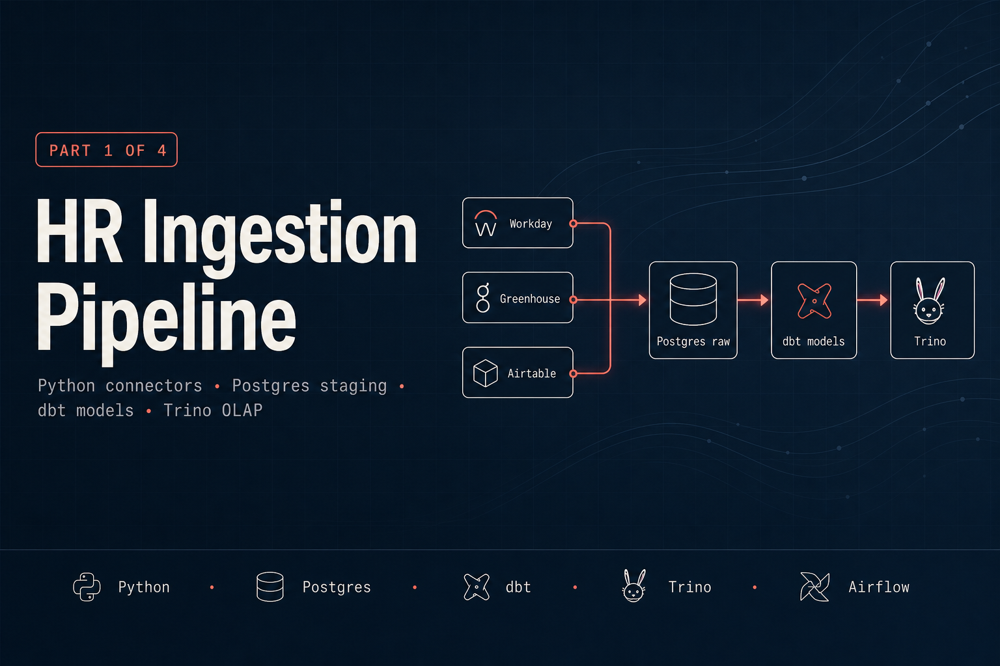

# workforce-intelligence-platform-ingestion — HR data ingestion pipeline

Part 1 of 4 in the [workforce-intelligence-platform](../README.md).

Pulls employee and job application data from three HR source systems,
lands it in a layered Postgres data model, transforms it with dbt, and
exposes analytical SQL via Trino. This module establishes the shared data
layer that all other platform modules depend on.

---

## Architecture

```
 Workday API (mock)          Greenhouse API (mock)        Airtable API (real)
      │                             │                            │
      ▼                             ▼                            ▼
 WorkdayConnector          GreenhouseConnector          AirtableConnector
      │                             │                            │
      └──────────────────┬──────────┘                            │
                         ▼                                       │
                  raw.employees                         raw.job_applications
                  raw.job_applications ◄────────────────────────┘
                         │
                         ▼
                    dbt (staging)
                  stg_employees
                  stg_job_applications
                         │
                         ▼
                    dbt (marts)
             dim_employees  ──────────────────► Trino OLAP
             fct_headcount_daily                     │
             fct_attrition_monthly                   ▼
             rpt_recruiting_funnel          dashboard/ (Project 4)
                         │
                         ▼
                  Airflow DAG: hr_ingestion (daily 06:00)
```

---

## Tech stack

| Concern | Technology |
|---|---|
| Language | Python 3.11 |
| HTTP client | httpx + tenacity (retry) |
| Data validation | Pydantic v2 |
| Database | Postgres 16 (pgvector image) |
| Transformations | dbt-core 1.8 + dbt-postgres |
| Analytical SQL | Trino 438 |
| Orchestration | Apache Airflow 2.9.1 |
| Testing | pytest + testcontainers |
| Synthetic data | faker 25+ |

---

## Setup

### Prerequisites
- Docker Desktop running
- `cp .env.example .env` at the **repo root** (supplies Postgres creds + per-role
  passwords; the defaults work out of the box for local dev)
- `make infra-up` executed from the repo root (starts Postgres + Trino + Airflow)

### Install and seed

```bash
cd 1-ingestion
pip install -e ".[dev]"
make seed          # generates 500 employees + 1000 job applications into Postgres
make dbt-run       # builds all dbt models
```

> `make seed` uses random identifiers, so re-running it **adds** another 500
> employees rather than replacing them. Run `make infra-reset` from the repo root
> to start from a clean database. (The Airflow DAG pulls from the mock server with
> stable IDs, so the scheduled pipeline is idempotent.)

### Verify Trino access

```bash
# Trino CLI (or DBeaver / any JDBC client). The container name is derived from
# the repo directory: <repo-dir>-trino-1 (e.g. 3-workforce-intelligence-platform-trino-1).
docker exec -it 3-workforce-intelligence-platform-trino-1 trino
> SELECT COUNT(*) FROM postgresql.analytics.dim_employees;
```

---

## Airtable base setup

1. Create a free Airtable account at https://airtable.com
2. Create a new base named `workforce-hr`
3. Create a table named `Employees` with these fields:

| Field name | Type |
|---|---|
| `source_id` | Single line text |
| `first_name` | Single line text |
| `last_name` | Single line text |
| `email` | Email |
| `department` | Single select |
| `job_title` | Single line text |
| `hire_date` | Date |
| `termination_date` | Date (optional) |
| `employment_type` | Single select |
| `level` | Single line text |
| `location` | Single line text |

4. Copy your Personal Access Token from https://airtable.com/create/tokens
5. Set `AIRTABLE_API_KEY` and `AIRTABLE_BASE_ID` in your `.env` file

> **Airtable is optional.** If those two variables are unset the connector reports
> itself as not configured and the pipeline runs end-to-end on the mock Workday /
> Greenhouse sources alone. The connector also reads an optional `Applications`
> table (same base) for job-application records; omit it to ingest employees only.

---

## Make targets

| Target | Description |
|---|---|
| `make setup` | `bootstrap` + `mock-server` + `seed` (full local bring-up) |
| `make bootstrap` | Install deps, then create platform roles + grants (needs Postgres up) |
| `make mock-server` | Start the mock Workday server in the background on `:5001` |
| `make seed` | Generate and load 500 employees + 1000 job applications into Postgres |
| `make dbt-run` | `dbt deps` + run all dbt models |
| `make dbt-test` | Run all dbt data tests |
| `make test-unit` | Run unit tests with coverage (no Docker needed) |
| `make test-integration` | Run integration tests (spins up Postgres via testcontainers) |
| `make test` | Run unit + integration tests |
| `make lint` | ruff (Python) + sqlfluff (dbt models) |
| `make clean` | Remove `__pycache__`, `*.pyc`, and coverage artifacts |
| `make teardown` | Graceful teardown (inverse of `infra-up` + `setup`): stop the local mock-server, drop the dbt schemas + truncate the `raw` tables, clear caches, and shut down the Docker stack |

> `make bootstrap` / `make setup` read the per-role passwords from the repo-root
> `.env` (loaded automatically by the Makefile) and require Postgres to be running.
> `make lint`'s sqlfluff step uses the dbt templater, so it compiles the project —
> run it after `make dbt-run` (or any `dbt deps`) with Postgres up.

### Tearing down

`make teardown` is the graceful inverse of `infra-up` + `setup`. It is re-runnable
and runs in this order (DB cleanup first, while Postgres is still up):

- stops any **local** mock-server (the host process from `make mock-server`);
- **drops** the dbt-built `staging` + `analytics` schemas (`make dbt-run` recreates them);
- **truncates** the `raw` landing tables — kept intact (the structure comes from
  `docker/init.sql`, applied once at volume init) so `make seed` works again
  **without** an `infra-reset`;
- runs `make clean`;
- shuts down the shared Docker stack via the repo-root `make infra-down`
  (postgres + trino + airflow + mock-hr).

The DB cleanup is skipped automatically if Postgres is already down, so teardown is
safe to run at any time. **Volumes are preserved** — sibling-module data
(`governance` / `dashboard` / `llm`) and Airflow metadata survive a teardown. The
shared platform login roles are also left intact. To additionally wipe the volumes
for a fully clean database, use the repo-root target:

```bash
make infra-reset    # docker compose down -v — full clean DB on next infra-up
```

To come back up after a teardown:

```bash
make infra-up                       # repo root — start the stack
make -C 1-ingestion setup           # bootstrap + seed
make -C 1-ingestion dbt-run         # rebuild the warehouse
```

---

## dbt models

| Model | Layer | Description |
|---|---|---|
| `stg_employees` | staging | Flattened JSONB from raw.employees |
| `stg_job_applications` | staging | Flattened JSONB from raw.job_applications |
| `dim_employees` | marts | Active employee dimension (SCD Type 1) |
| `fct_headcount_daily` | marts | Daily headcount by department/level |
| `fct_attrition_monthly` | marts | Monthly attrition rate + rolling 12m |
| `rpt_recruiting_funnel` | reports | Application → hire funnel by job/month |

---

## Orchestration

The `hr_ingestion` DAG (`airflow/dags/hr_ingestion_dag.py`, daily 06:00) wires the
full pipeline: extract from each source → land in `raw` → detect schema drift →
`dbt build` → alert on PII drift → trigger the downstream `llm_eval` refresh.

It runs end-to-end in the bundled Airflow stack. From the repo root:

```bash
make infra-up                                   # postgres + trino + mock-hr + airflow
# Airflow UI at http://localhost:8081 (admin / admin)
docker compose exec airflow-scheduler airflow dags trigger hr_ingestion
```

How the bundled stack makes the DAG runnable (see `docker-compose.yml`):
- the `mock-hr` service serves both Workday workers and Greenhouse applications, so
  `extract_workday` / `extract_greenhouse` hit a real HTTP stack;
- the `1-ingestion` tree is mounted at `/opt/ingestion` (`PYTHONPATH`) and the
  connector/dbt deps are installed via `_PIP_ADDITIONAL_REQUIREMENTS`, so `src` and
  `dbt` are importable in the scheduler;
- `extract_airtable` is optional — with no real Airtable base it logs a warning and
  skips, leaving the rest of the run green.

> For a hardened deployment, bake the project into a custom Airflow image instead of
> installing deps at container startup.

---

## Design decisions

**Upsert over truncate-load.** Idempotent upserts on `(source, source_id)` mean the DAG can
be safely re-run without duplicating records. Truncate-load would require point-in-time recovery
if downstream transforms had already consumed the data.

**Salary and performance_rating excluded from dim_employees.** These fields exist in the raw layer
but are deliberately absent from the analytics-layer dimension. The governance module (Project 3)
adds them as restricted columns accessible only to roles with explicit grants. This models the
separation of concerns between data engineering and data access policy.

**Trino on top of Postgres.** The Postgres instance is the OLTP source of truth. Trino adds a
federated OLAP query layer without copying data — queries from the dashboard or ad-hoc analysts
hit Trino, which pushes predicates down to Postgres. This mirrors production patterns at companies
that run Trino against their operational stores.

**Mock servers over static fixtures.** The mock Workday and Greenhouse servers generate paginated
REST responses from the same synthetic data generator used in tests. This means the connector code
runs against a real HTTP client stack, not mocked responses — integration tests find bugs that
unit tests miss.
